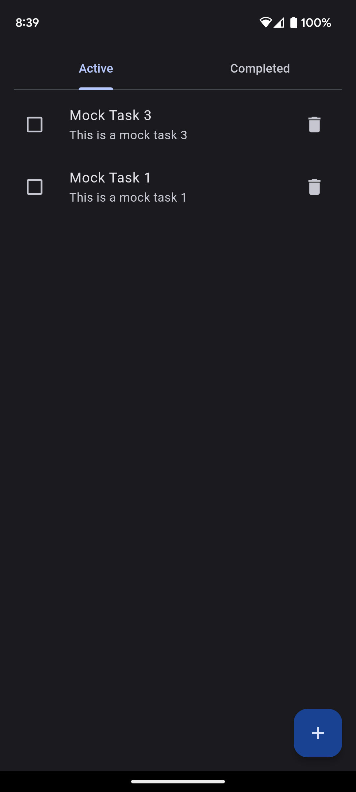
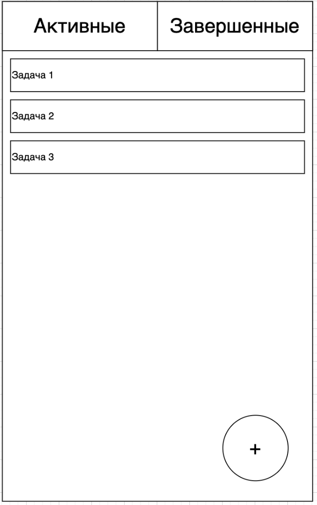
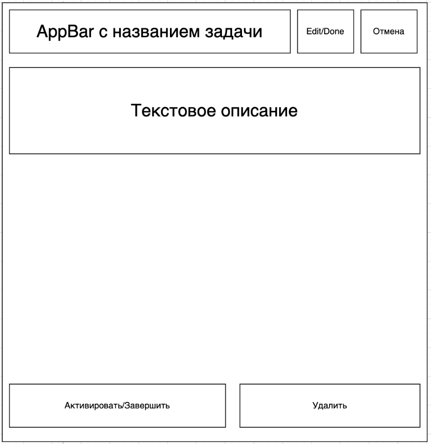
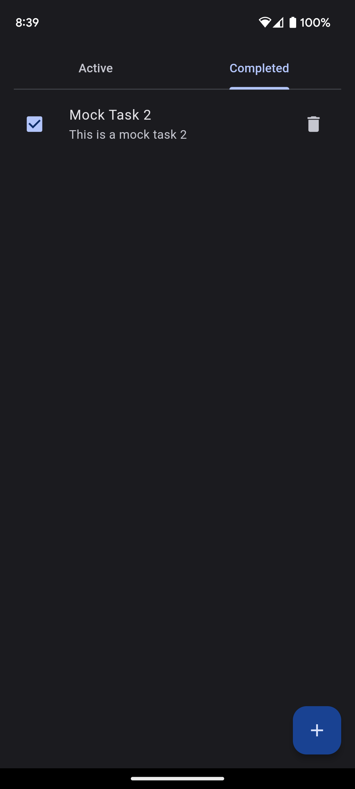
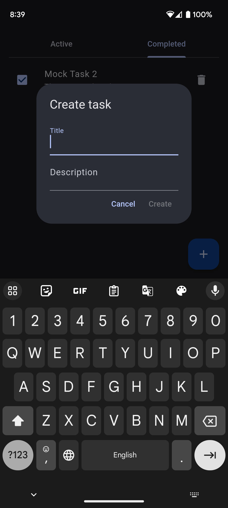
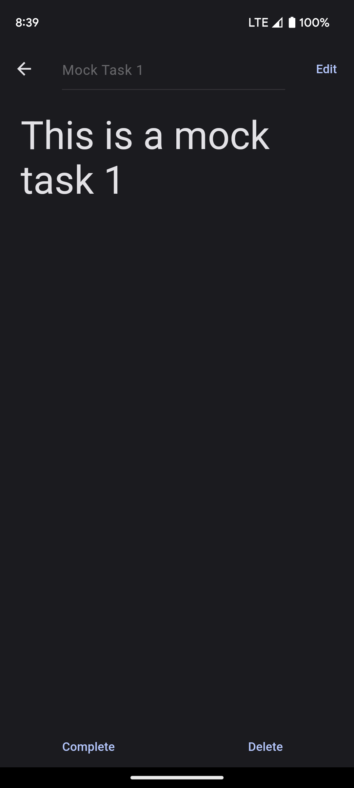
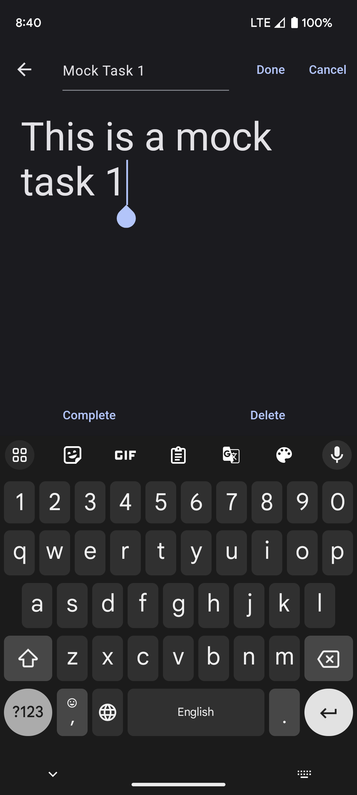

# Simple Todo App

Simple application with a to-do list.

  

 

## Task:
- Write a performant, clean, and scalable solution.
- Implement using Elementary + BLoC.
- The goal of the test is to assess architectural skills and decisions made.
- It is allowed to introduce additional ideas into the UI, but do not reduce the original specifications.

## Features

### To-Do List Screen.

- Consists of 2 tabs - active and completed.
- Task widget - checkbox and text description. Task delete button.
- Clicking on the checkbox moves the task to the completed tab.
- Clicking on the delete button removes the task.

  

### Task Adding Dialog.

- Text field for task title.
- Text field for task description.
- Save button - adds a new task with the entered description to the active tab.

### Task Viewing Screen

- "Edit" button - to edit the task. Ability to edit the title and text description.
- "Done" button, if you need to finish editing and apply the result.
- "Cancel" button - only in edit mode to cancel the result.
- "Activate" button - if the task is completed, move it to active.
- "Complete" button - if the task is active, move it to active.
- "Delete" - deletes the task.

  

# Under the hood

The project is written using the Clean Architecture principles. It consists of three layers - domain, data, and presentation.

## Domain
The layer describes the business logic of the application. Domain layer is unaware of other layers and is completely independent.

### DTO
DTO's are objects that carries data between layers of application. 

There are two cases where the domain layer can receive or send objects: creating a task and updating a task. So we have [CreateTaskDTO] and [UpdateTaskDTO]

### Entities
Todo list is just a list with tasks. So we need just one [TaskEntity] for that project. 

### Repository
Repository have to just describe business operations without implementation. This is why [TodoRepository] is abstract class.

### Bloc
I'm trying to love SOLID. So I separated TODO logic to 3 groups of operations: working with todo list, task creating and working with one task. 

[TodoListBloc] fetches todo list.

[TaskCreatingBloc] creating (Yeah, yeah, unexpected) a new task and inform [TodoListBloc] about that task.

[TaskBloc] contains events for task's title and description changing, status changing and deleting. Also inform [TodoListBloc] about changes.

[CreateTaskDTO]: ./lib/features/todo/domain/dto/create_task_dto.dart
[UpdateTaskDTO]: ./lib/features/todo/domain/dto/update_task_dto.dart
[TaskEntity]: ./lib/features/todo/domain/entity/task_entity.dart
[TodoRepository]: ./lib/features/todo/domain/repository/todo_repository.dart
[TodoListBloc]: ./lib/features/todo/domain/bloc/todo_list/todo_list_bloc.dart
[TaskBloc]: ./lib/features/todo/domain/bloc/task/task_bloc.dart
[TaskCreatingBloc]: ./lib/features/todo/domain/bloc/task_creating/task_creating_bloc.dart

## Data
The layer implements repository from domain. To do this, I use DataSources.
Remote data sources (RDS) used to connect with remote server. For example, REST API client .
Local data sources (LDS) contains logic for working with data on user's device like databases or files. We can use that for cache or data saving.
Of course I'm using interfaces for interact with data sources. I don't have any RDS's for that project (come on, it is just todo app). And I don't need realize interacting with databases. But I decided to make [TodoLDS] interface and his implementation [MockTodoLDS]. Later I will be able to change mocks to implementation with real database.

[TodoLDS]: ./lib/features/todo/data/source/local/todo_lds.dart
[MockTodoLDS]: ./lib/features/todo/data/source/local/impl/mock_todo_lds.dart

## Presentation
I like MVVM architecture. Okay, we figured out the M-part (model). Now I have to write **View**s, because we want to make an app for users, not just code for other developers, right?

And I also want to separate the logic from the layout. So the **ViewModel**. I usually use the Stacked library, Elementary or the self-described Well (unpublished) for this purpose. 

The assignment requires me to use [Elementary]. Why not?
According to the library canons, each logical part of the application contains three parts: **Model**, **WidgetModel** and **Widget**. 

I use Model for connect widget to domain layer. WidgetModel for describe logic of widget. And widget for describe layout.

[Elementary]: https://pub.dev/packages/elementary

### JSON and Serialization

JSON models are serialized using a code generation library.

For one time code generation run this command in terminal: `dart run build_runner build`

For subsequent code generations with conflicting outputs: `dart run build_runner build --delete-conflicting-outputs`

For more information and generating code continuously see [the documentation of dart_mappable][dart_mappable].

[dart_mappable]: https://pub.dev/packages/dart_mappable

## Dependency Management

Dependencies are managed by the [Provider] library.
Example of Provider using: [TodoDependencies].

[Provider]: https://pub.dev/packages/provider
[TodoDependencies]: ./lib/features/todo/di/todo_dependencies.dart

## Theme
I chose default Material 3 theme without any changes. But I just selected cute blue color for theme's seed.
When else will I be able to create an app without design quirks? hehe

## Result

Active list |  Completed list
:-------------------------:|:-------------------------:
  |  

Task creating | Task view | Task editing
:-------------------------:|:-------------------------:|:-------------------------:
  |    |  

## What could be improved?
- Add detailed documentation
- Write tests
- Make error handling to send to a service like Crashlytics or Sentry in the future. Ideally, make classes for errors and separate them by type to filter them and depending on the type send or not send them to the Crashlytics service
- Add routing like GoRouter or AutoRouter
- Add localization